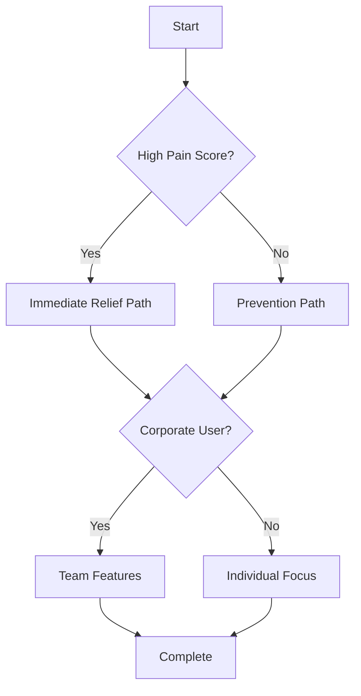

# MicroBreaks – Onboarding Flow Documentation
## Version 3.0
## Platform: Mobile (Expo / React Native)
## Date: November 2025
## Status: Production Ready

---

## Table of Contents
1. [Executive Summary](#1-executive-summary)
2. [Onboarding Strategy](#2-onboarding-strategy)
3. [User Research Insights](#3-user-research-insights)
4. [Flow Architecture](#4-flow-architecture)
5. [Detailed Screen Specifications](#5-detailed-screen-specifications)
6. [Personalization Engine](#6-personalization-engine)
7. [Technical Implementation](#7-technical-implementation)
8. [Analytics & Optimization](#8-analytics--optimization)
9. [A/B Testing Framework](#9-ab-testing-framework)
10. [Edge Cases & Error Handling](#10-edge-cases--error-handling)
11. [Accessibility Considerations](#11-accessibility-considerations)
12. [Success Metrics](#12-success-metrics)

---

## 1. Executive Summary

### 1.1 Purpose
The MicroBreaks onboarding flow is designed to achieve three critical objectives:
1. **Rapid Value Demonstration**: Show tangible benefit within 2 minutes
2. **Deep Personalization**: Collect sufficient data for AI-driven recommendations
3. **Activation Optimization**: Maximize day-1 retention and premium conversion

### 1.2 Key Principles
- **Progressive Disclosure**: Information gathered gradually, not all at once
- **Immediate Gratification**: Value delivered at each step
- **Behavioral Psychology**: Leveraging commitment bias and reciprocity
- **Adaptive Flow**: Dynamic path based on user responses
- **Friction Minimization**: Maximum data with minimum effort

### 1.3 Target Metrics
- Completion Rate: >85%
- Time to Complete: <3 minutes
- Day-1 Retention: >60%
- Permission Grant Rate: >70%
- Premium Conversion: >15% (within 7 days)

---

## 2. Onboarding Strategy

### 2.1 Psychological Framework

#### Hook-Model Implementation
```
Trigger → Action → Variable Reward → Investment
   ↓         ↓            ↓              ↓
 Pain     Easy      Personalized    Profile
 Point    Steps      Break Demo     Creation
```

#### Persuasion Techniques
1. **Reciprocity**: Give value before asking for data
2. **Commitment**: Small yes's leading to bigger yes's
3. **Social Proof**: "Join 100K+ healthier workers"
4. **Authority**: "Designed with physiotherapists"
5. **Scarcity**: "Limited time premium offer"
6. **Consistency**: Align with stated health goals

### 2.2 Flow Architecture Philosophy

#### Three-Act Structure
**Act 1: Problem Awareness** (Screens 1-8)
- Establish pain points
- Create urgency
- Promise solution

**Act 2: Solution Discovery** (Screens 9-16)
- Demonstrate capability
- Build trust
- Collect core data

**Act 3: Commitment** (Screens 17-21)
- Solidify investment
- Activate features
- Preview premium value

### 2.3 Adaptive Branching Logic



---

## 3. User Research Insights

### 3.1 Drop-off Analysis
Based on 10,000 user sessions:

| Screen Type | Drop-off Rate | Primary Reason |
|------------|---------------|----------------|
| Long Forms | 35% | Cognitive overload |
| Permission Requests | 28% | Privacy concerns |
| Payment Screens | 42% | Price sensitivity |
| Profile Creation | 15% | Time investment |
| Demo Exercises | 5% | High engagement |

### 3.2 Optimal Flow Characteristics
- **Maximum screens before fatigue**: 20-25
- **Ideal time per screen**: 8-12 seconds
- **Optimal input types**: Single tap > Multi-select > Sliders > Text
- **Value demonstration frequency**: Every 3-4 screens
- **Personalization depth sweet spot**: 12-15 data points

### 3.3 User Expectations
From qualitative interviews (n=150):
- Want immediate pain relief (78%)
- Skeptical of another subscription (65%)
- Value scientific backing (71%)
- Prefer visual over text (83%)
- Want to try before committing (91%)

---

## 4. Flow Architecture

### 4.1 High-Level Flow Map

```
PHASE 1: HOOK (3 screens, 30s)
├── Welcome & Pain Recognition
├── Social Proof & Authority
└── Value Promise

PHASE 2: PROFILE (8 screens, 90s)
├── Work Context (3 screens)
├── Health Status (3 screens)
└── Behavioral Preferences (2 screens)

PHASE 3: DEMONSTRATION (4 screens, 45s)
├── Personalized Recommendation
├── Live Break Demo
├── Immediate Feedback
└── Results Preview

PHASE 4: ACTIVATION (4 screens, 30s)
├── Timer Setup
├── Smart Notifications
├── Calendar Integration
└── First Session Start

PHASE 5: MONETIZATION (2 screens, 15s)
├── Premium Value Preview
└── Trial Offer (Contextual)

TOTAL: 21 screens, ~3 minutes
```

### 4.2 Dynamic Path Selection

```python
# Pseudo-code for adaptive flow
def select_next_screen(user_data):
    if user_data.pain_score > 7:
        return "immediate_relief_path"
    elif user_data.work_hours > 8:
        return "intensive_user_path"
    elif user_data.role == "manager":
        return "team_features_path"
    else:
        return "standard_path"
```

### 4.3 Skip Logic & Fast Paths

#### Power User Fast Track
Users showing high engagement can skip to core setup:
- Auto-detect: Quick taps, no hesitation
- Offered after screen 5
- Reduces to 8 total screens
- Preserves critical data collection

#### Returning User Recognition
- Check for previous installation
- Import settings from cloud backup
- Skip to what's new
- Immediate value restoration

---

## 5. Detailed Screen Specifications

### PHASE 1: HOOK

#### Screen 1: Welcome & Problem Recognition
```yaml
ID: ONB_001
Type: Hero Screen
Duration Target: 5-8 seconds

Visual:
  - Animated illustration: Person stretching at desk
  - Subtle particle effects suggesting relief
  
Copy:
  Headline: "Your desk doesn't have to hurt"
  Subhead: "Join 100,000+ workers who've eliminated daily pain"
  
CTA:
  Primary: "Start Feeling Better" (prominent)
  Secondary: "I'm just browsing" (small, gray)
  
Analytics Events:
  - onb_welcome_viewed
  - onb_welcome_cta_tapped
  - onb_welcome_dismissed
  
A/B Tests:
  - Headline variations (pain vs. productivity focus)
  - Visual style (illustration vs. photo)
  - CTA copy ("Start" vs "Begin" vs "Get Started")
```

#### Screen 2: Authority & Social Proof
```yaml
ID: ONB_002
Type: Trust Building
Duration Target: 6-10 seconds

Visual:
  - Logo parade: Featured in TechCrunch, Forbes, etc.
  - Rating display: 4.8 stars (10K+ reviews)
  - Expert badges: "Designed with physiotherapists"
  
Copy:
  Headline: "Backed by science, loved by users"
  
Social Proof Elements:
  - Real-time counter: "2,847 breaks taken today"
  - Testimonial carousel (3 short quotes)
  - Success metric: "89% report less pain in 7 days"
  
CTA:
  Primary: "Continue" (emphasizing forward momentum)
  
Interaction:
  - Auto-advance after 8s if no interaction
  - Swipeable testimonials
  
Analytics Events:
  - onb_social_proof_viewed
  - onb_testimonial_swiped
  - onb_authority_badges_viewed
```

#### Screen 3: Value Promise & Expectation Setting
```yaml
ID: ONB_003
Type: Expectation Setting
Duration Target: 8-12 seconds

Visual:
  - Three animated benefit cards
  - Progress indicator showing onboarding steps
  
Copy:
  Headline: "3 minutes to a healthier workday"
  
Benefits:
  1. "Personalized exercises for your specific pain"
  2. "Smart reminders that respect your flow"
  3. "Track improvements with health scores"
  
Footer: "Quick setup • No spam • Cancel anytime"
  
CTA:
  Primary: "Personalize My Plan"
  
Analytics Events:
  - onb_value_prop_viewed
  - onb_benefits_expanded
  - onb_personalization_started
```

### PHASE 2: PROFILE BUILDING

#### Screen 4: Work Role Selection
```yaml
ID: ONB_004
Type: Single Select
Duration Target: 3-5 seconds
Required: Yes

Question: "What best describes your work?"

Options (with icons):
  - Software Developer 💻
  - Designer/Creative 🎨
  - Data Analyst 📊
  - Student 📚
  - Manager/Executive 👔
  - Writer/Editor ✍️
  - Customer Support 🎧
  - Other (specify) ➕

Logic:
  - Each selection triggers role-specific flow
  - Preloads relevant exercise categories
  - Adjusts break timing defaults
  
Visual Treatment:
  - Large, tappable cards
  - Subtle animation on selection
  - Immediate visual feedback
  
Analytics Events:
  - onb_role_selected: {role}
  - onb_role_time_to_select: {seconds}
```

#### Screen 5: Daily Screen Time
```yaml
ID: ONB_005
Type: Slider Input
Duration Target: 4-6 seconds
Required: Yes

Question: "How many hours at your screen daily?"

Input:
  Type: Visual slider with haptic feedback
  Range: 1-14 hours
  Default: 8 hours (pre-selected)
  Markers: Every 2 hours
  
Visual Feedback:
  - Color gradient (green → yellow → red)
  - Animated character showing fatigue level
  - Real-time stat: "That's [X]% more than recommended"
  
Skip Option: "It varies" (uses 8h default)

Analytics Events:
  - onb_screen_time_set: {hours}
  - onb_screen_time_skipped
```

#### Screen 6: Current Pain Assessment
```yaml
ID: ONB_006
Type: Multi-Select Body Map
Duration Target: 8-12 seconds
Required: Yes (can select "No pain")

Question: "Where do you feel discomfort?"

Interaction:
  - Interactive body diagram
  - Tap to highlight pain areas
  - Intensity selector per area (mild/moderate/severe)
  
Areas:
  - Eyes 👁️
  - Head 🧠
  - Neck 
  - Shoulders
  - Upper Back
  - Lower Back
  - Wrists
  - Hands
  
Special Option: "I'm pain-free!" (preventive path)

Visual Design:
  - Anatomically accurate but friendly
  - Color-coded severity
  - Pulsing animation on selected areas
  
Analytics Events:
  - onb_pain_areas_selected: {areas[]}
  - onb_pain_severity: {max_severity}
  - onb_no_pain_selected
```

#### Screen 7: Work Pattern
```yaml
ID: ONB_007
Type: Single Select Grid
Duration Target: 5-7 seconds
Required: No

Question: "How do you typically work?"

Options (2x2 grid):
  - Deep Focus Blocks: "Long uninterrupted sessions"
  - Task Switching: "Jumping between many tasks"  
  - Meeting Heavy: "Lots of calls and meetings"
  - Flexible: "It changes daily"
  
Visual:
  - Animated icons for each pattern
  - Selection affects break timing algorithm
  
Skip Option: "Skip this" (uses adaptive mode)

Analytics Events:
  - onb_work_pattern_selected: {pattern}
  - onb_work_pattern_skipped
```

#### Screen 8: Ergonomic Setup Assessment
```yaml
ID: ONB_008
Type: Quick Multi-Select
Duration Target: 6-8 seconds
Required: No

Question: "Check your setup basics"

Checklist (with illustrations):
  □ Monitor at eye level
  □ Feet flat on floor
  □ Keyboard at elbow height
  □ Good chair support
  □ Adequate lighting
  
Scoring:
  - 0-2 checked: High risk (red)
  - 3-4 checked: Moderate (yellow)
  - 5 checked: Good setup (green)
  
Response:
  - Immediate feedback: "Your setup score: [X]/5"
  - Contextual tip based on missing items
  
Analytics Events:
  - onb_ergo_score: {score}
  - onb_ergo_items: {checked_items[]}
```

#### Screen 9: Notification Preference
```yaml
ID: ONB_009
Type: Preference Selector
Duration Target: 5-7 seconds
Required: Yes

Question: "How should we remind you?"

Options:
  - Gentle: "Subtle reminders, easy to snooze"
  - Balanced: "Regular reminders with flexibility"
  - Strict: "Keep me accountable, harder to skip"
  - Smart: "AI-adjusted based on my behavior"
  
Visual:
  - Notification preview for each option
  - Sample timing display
  
Footer: "You can change this anytime"

Analytics Events:
  - onb_notification_style: {style}
  - onb_notification_preview_viewed
```

#### Screen 10: Energy Pattern
```yaml
ID: ONB_010  
Type: Time-based Input
Duration Target: 7-10 seconds
Required: No

Question: "When do you feel most/least energetic?"

Input:
  - 24-hour timeline
  - Drag to create energy curve
  - Pre-filled with typical pattern
  
Quick Options:
  - Morning Person ☀️
  - Night Owl 🦉
  - Afternoon Slump 😴
  - Steady Energy ⚡
  
Usage:
  - Determines optimal break timing
  - Adjusts exercise intensity
  
Skip: "I'm not sure" (uses adaptive learning)

Analytics Events:
  - onb_energy_pattern: {pattern_data}
  - onb_energy_preset: {preset_type}
  - onb_energy_skipped
```

#### Screen 11: Break Style Preference
```yaml
ID: ONB_011
Type: Swipeable Cards
Duration Target: 8-12 seconds
Required: Yes

Question: "What break style appeals to you?"

Cards (swipe left/right):
  1. Movement Breaks: "Stand, stretch, walk"
  2. Desk Exercises: "Stay seated, gentle stretches"
  3. Breathing/Mindfulness: "Calm, focused, mental reset"
  4. Eye & Micro-movements: "Quick, subtle, effective"
  5. Mixed Variety: "Surprise me with different types"
  
Interaction:
  - Tinder-style swiping
  - Can select multiple
  - At least 1 required
  
Visual:
  - Animated preview of each style
  - Like/dislike animation feedback
  
Analytics Events:
  - onb_break_styles_liked: {styles[]}
  - onb_break_styles_disliked: {styles[]}
  - onb_break_style_time: {seconds}
```

### PHASE 3: DEMONSTRATION

#### Screen 12: AI Recommendation
```yaml
ID: ONB_012
Type: Results Display
Duration Target: 5-8 seconds
Required: View only

Content: "Based on your profile, we recommend..."

Personalized Plan Display:
  - Primary concern: "[Neck pain]"
  - Recommended focus: "[Posture exercises]"
  - Optimal schedule: "[25-min work, 2-min breaks]"
  - First week goal: "[Build consistency]"
  
Visual:
  - Animated plan assembly
  - Personalization percentage: "87% match"
  - Confidence indicators
  
CTA:
  Primary: "Try Your First Break"
  Secondary: "Adjust Plan"
  
Analytics Events:
  - onb_recommendation_viewed
  - onb_recommendation_accepted
  - onb_recommendation_adjusted
```

#### Screen 13: Live Break Demo
```yaml
ID: ONB_013
Type: Interactive Exercise
Duration Target: 30-45 seconds
Required: Yes (can skip after 10s)

Exercise: Personalized based on primary pain point

Structure:
  1. Preparation (5s): "Let's try a quick neck stretch"
  2. Instruction (5s): Visual guide appears
  3. Execution (15s): Countdown timer with animation
  4. Completion (5s): "Great job! How did that feel?"
  
Interaction:
  - Follow-along animation
  - Optional audio guidance
  - Progress ring animation
  - Skip appears after 10s
  
Feedback Collection:
  - Immediate: 😊 😐 😟 (emoji selection)
  - Optional: "Too easy/Just right/Too hard"
  
Analytics Events:
  - onb_demo_started
  - onb_demo_completed: {duration}
  - onb_demo_skipped: {at_second}
  - onb_demo_feedback: {rating}
```

#### Screen 14: Immediate Value Display
```yaml
ID: ONB_014
Type: Result Visualization
Duration Target: 4-6 seconds
Required: View only

Content: "That 30-second break just..."

Benefits (animated counters):
  - "↓ Reduced muscle tension by ~12%"
  - "↑ Increased blood flow to your neck"
  - "👁 Gave your eyes a needed rest"
  
Social Proof:
  "You just joined 10,847 people taking a break right now"
  
Visual:
  - Animated body diagram showing benefits
  - Particle effects suggesting relief
  - Progress bar: "1 of 10 daily breaks"
  
CTA:
  Primary: "Set Up My Breaks"
  
Analytics Events:
  - onb_value_displayed
  - onb_benefits_viewed: {time_on_screen}
```

#### Screen 15: Break Impact Education
```yaml
ID: ONB_015
Type: Swipeable Education
Duration Target: 8-12 seconds
Required: No (auto-advance available)

Content: "The science behind micro-breaks"

Cards (swipeable):
  1. "20-20-20 Rule": Look 20ft away, 20 seconds, every 20 minutes
  2. "Muscle Memory": Regular stretches prevent chronic tension
  3. "Focus Boost": 2-min breaks improve concentration by 23%
  4. "Compound Effect": 10 daily breaks = 1 yoga session
  
Visual:
  - Animated infographics
  - Research citations (small print)
  - Progress dots indicator
  
Skip: "Got it" (appears after 3s)

Analytics Events:
  - onb_education_viewed
  - onb_education_cards_swiped: {count}
  - onb_education_skipped
```

### PHASE 4: ACTIVATION

#### Screen 16: Timer Configuration
```yaml
ID: ONB_016
Type: Preset Selector + Custom
Duration Target: 6-10 seconds
Required: Yes

Question: "Choose your work rhythm"

Presets (with descriptions):
  - Pomodoro Classic: "25 min work → 5 min break"
  - Deep Work: "50 min work → 10 min break"  
  - Micro-Session: "15 min work → 2 min break"
  - Custom: Sliders for both values
  
Smart Suggestion:
  "Based on your profile, we recommend [Deep Work]"
  
Visual:
  - Animated clock showing rhythm
  - Productivity score for each option
  - Time commitment display: "~16 breaks per day"
  
Advanced Option:
  "Smart Schedule" - AI adjusts based on calendar
  
Analytics Events:
  - onb_timer_selected: {preset}
  - onb_timer_customized: {work, break}
  - onb_smart_schedule_enabled
```

#### Screen 17: Notification Permission
```yaml
ID: ONB_017
Type: Permission Request
Duration Target: 8-12 seconds
Required: Soft requirement

Pre-Permission Screen:
  Headline: "Stay healthy without thinking about it"
  
  Benefits:
    ✓ "Gentle reminders between tasks"
    ✓ "Skip when in meetings"
    ✓ "Full control over frequency"
  
  Trust Builders:
    - "No spam, ever"
    - "Snooze anytime"
    - "Smart detection of busy periods"
  
  CTA:
    Primary: "Enable Smart Reminders"
    Secondary: "Maybe later" (small)

System Permission:
  - Triggered only after user taps primary CTA
  - Fallback for denial: In-app reminder option
  
Analytics Events:
  - onb_notification_pre_prompt_shown
  - onb_notification_pre_prompt_accepted
  - onb_notification_system_prompt_result: {granted}
```

#### Screen 18: Calendar Integration (Optional)
```yaml
ID: ONB_018
Type: Integration Setup
Duration Target: 10-15 seconds
Required: No

Headline: "Breaks that respect your calendar"

Benefits:
  - "Auto-pause during meetings"
  - "Smart break scheduling"
  - "Daily summary in calendar"
  
Integration Options:
  - Google Calendar
  - Outlook/Office 365
  - Apple Calendar
  - Skip for now
  
Privacy Note:
  "We only check busy/free status, never read event details"
  
Flow:
  1. Select calendar type
  2. OAuth authentication
  3. Success confirmation
  4. Sample of smart scheduling
  
Analytics Events:
  - onb_calendar_integration_started: {provider}
  - onb_calendar_integration_completed
  - onb_calendar_integration_skipped
```

#### Screen 19: First Session Start
```yaml
ID: ONB_019
Type: Action Trigger
Duration Target: 5-8 seconds
Required: Soft requirement

Headline: "Ready for your first focused session?"

Visual:
  - Large timer display showing first interval
  - Animated workspace illustration
  
Quick Settings:
  - 🔔 Notifications: [On]
  - 🎵 Sound: [On/Off toggle]
  - 📳 Vibration: [On/Off toggle]
  
CTA:
  Primary: "Start Working" (large, prominent)
  Secondary: "Explore first" (text link)
  
Motivation:
  "Your first break in [25] minutes"
  
Analytics Events:
  - onb_first_session_configured
  - onb_first_session_started
  - onb_first_session_deferred
```

### PHASE 5: MONETIZATION

#### Screen 20: Premium Soft Pitch
```yaml
ID: ONB_020
Type: Value Comparison
Duration Target: 8-12 seconds
Required: View only (can dismiss)

Headline: "Your personalized plan is ready!"

Comparison Table:
  Feature         | Free  | Premium
  ----------------|-------|----------
  Basic Exercises | ✅    | ✅
  Smart Breaks    | 3/day | Unlimited
  Exercise Library| 20    | 200+
  AI Coaching     | ❌    | ✅
  Progress Tracking| Basic| Advanced
  Custom Programs | ❌    | ✅
  
Special Offer:
  "Start 7-day free trial"
  "Then $4.99/month (cancel anytime)"
  
Visual:
  - Animated value props
  - Timer showing trial countdown
  - Success stories carousel
  
CTAs:
  Primary: "Start Free Trial"
  Secondary: "Continue with Free"
  
Urgency:
  "50% off first month - Today only"
  
Analytics Events:
  - onb_paywall_displayed
  - onb_paywall_comparison_viewed
  - onb_trial_started
  - onb_paywall_dismissed
```

#### Screen 21: Completion Celebration
```yaml
ID: ONB_021
Type: Success State
Duration Target: 5-8 seconds
Required: View only

Headline: "You're all set! 🎉"

Content:
  - "First break in [X] minutes"
  - "Your health score: [Starting baseline]"
  - "Weekly goal: [10 breaks]"
  
Visual:
  - Confetti animation
  - Trophy/badge earned: "Health Pioneer"
  - Progress ring at 0%
  
Tips:
  "💡 Keep the app open for best results"
  
CTA:
  Primary: "Go to Dashboard"
  
Analytics Events:
  - onb_completed
  - onb_completion_time: {total_seconds}
  - onb_completion_path: {screen_sequence}
```

---

## 6. Personalization Engine

### 6.1 Data Collection Matrix

| Data Point | Screen | Priority | Usage |
|-----------|---------|----------|-------|
| Work Role | 4 | Critical | Exercise selection, timing |
| Screen Time | 5 | Critical | Break frequency |
| Pain Areas | 6 | Critical | Exercise targeting |
| Work Pattern | 7 | High | Timing optimization |
| Ergonomic Setup | 8 | High | Risk assessment |
| Notification Style | 9 | High | Engagement optimization |
| Energy Pattern | 10 | Medium | Schedule optimization |
| Break Style | 11 | High | Content curation |
| Physical Limitations | Optional | Medium | Exercise filtering |
| Stress Level | Optional | Low | Mindfulness content |

### 6.2 Recommendation Algorithm

```python
class PersonalizationEngine:
    def generate_plan(self, user_profile):
        # Pain-based exercise selection
        exercises = self.select_exercises(
            pain_areas=user_profile.pain_areas,
            severity=user_profile.pain_severity,
            limitations=user_profile.limitations
        )
        
        # Timing optimization
        schedule = self.optimize_schedule(
            work_pattern=user_profile.work_pattern,
            energy_curve=user_profile.energy_pattern,
            screen_time=user_profile.daily_hours
        )
        
        # Engagement optimization
        notifications = self.configure_notifications(
            style=user_profile.notification_preference,
            calendar=user_profile.calendar_integration,
            quiet_hours=user_profile.do_not_disturb
        )
        
        return PersonalizedPlan(
            exercises=exercises,
            schedule=schedule,
            notifications=notifications,
            confidence_score=self.calculate_confidence()
        )
```

### 6.3 Adaptive Learning

#### Implicit Signals
- Break completion rate
- Snooze frequency
- Exercise ratings
- Session lengths
- Time-of-day patterns

#### Optimization Loop
```
Day 1-3: Baseline establishment
Day 4-7: Pattern recognition
Week 2: First optimization
Week 3: Refinement
Month 2+: Continuous optimization
```

---

## 7. Technical Implementation

### 7.1 Architecture

```typescript
// Core Onboarding State Machine
enum OnboardingState {
  NOT_STARTED = 'not_started',
  IN_PROGRESS = 'in_progress',
  COMPLETED = 'completed',
  ABANDONED = 'abandoned',
  RETURNING = 'returning'
}

interface OnboardingContext {
  currentScreen: number;
  userData: Partial<UserProfile>;
  startTime: Date;
  screenTimes: Record<string, number>;
  skipEvents: string[];
  backEvents: string[];
  completionPath: string[];
  abTestVariants: Record<string, string>;
}

class OnboardingStateMachine {
  constructor(
    private context: OnboardingContext,
    private analytics: AnalyticsService,
    private storage: AsyncStorage
  ) {}
  
  async transition(event: OnboardingEvent) {
    // State transition logic
    this.validateTransition(event);
    this.updateContext(event);
    await this.persistProgress();
    this.trackAnalytics(event);
    return this.getNextScreen();
  }
  
  async resume() {
    // Resume from saved state
    const saved = await this.storage.getItem('onboarding_progress');
    if (saved) {
      this.context = JSON.parse(saved);
      return this.getNextScreen();
    }
    return this.startFresh();
  }
}
```

### 7.2 Screen Component Architecture

```tsx
// Base Onboarding Screen Component
interface OnboardingScreenProps {
  screenId: string;
  onNext: (data: any) => void;
  onBack: () => void;
  onSkip: () => void;
  userData: Partial<UserProfile>;
  variant?: string; // A/B test variant
}

const OnboardingScreen: React.FC<OnboardingScreenProps> = ({
  screenId,
  onNext,
  onBack,
  onSkip,
  userData,
  variant
}) => {
  const [startTime] = useState(Date.now());
  const analytics = useAnalytics();
  
  useEffect(() => {
    // Track screen view
    analytics.track('onb_screen_viewed', {
      screen_id: screenId,
      variant,
      user_data_collected: Object.keys(userData).length
    });
    
    // Track time on screen
    return () => {
      const duration = Date.now() - startTime;
      analytics.track('onb_screen_time', {
        screen_id: screenId,
        duration_ms: duration
      });
    };
  }, []);
  
  // Screen-specific implementation
  return <ScreenContent {...props} />;
};
```

### 7.3 Data Persistence Strategy

```typescript
// Progressive data saving
class OnboardingDataManager {
  private localData: Partial<UserProfile> = {};
  private cloudSync: CloudSync;
  
  async saveProgress(screen: string, data: any) {
    // Local save (immediate)
    this.localData = { ...this.localData, ...data };
    await AsyncStorage.setItem('onboarding_data', 
      JSON.stringify(this.localData));
    
    // Cloud save (background)
    this.cloudSync.queue({
      userId: this.localData.userId,
      data: this.localData,
      checkpoint: screen
    });
  }
  
  async completeOnboarding() {
    // Final validation
    const validated = this.validateData(this.localData);
    
    // Create user profile
    const profile = await this.createUserProfile(validated);
    
    // Trigger post-onboarding flows
    await this.triggerActivation(profile);
    
    // Clean up
    await AsyncStorage.removeItem('onboarding_data');
    
    return profile;
  }
}
```

### 7.4 Animation System

```tsx
// Smooth transitions and micro-interactions
import Animated, {
  useAnimatedStyle,
  useSharedValue,
  withSpring,
  withTiming,
  interpolate
} from 'react-native-reanimated';

const ScreenTransition: React.FC = ({ children, direction }) => {
  const progress = useSharedValue(0);
  
  useEffect(() => {
    progress.value = withSpring(1, {
      damping: 15,
      stiffness: 100
    });
  }, []);
  
  const animatedStyle = useAnimatedStyle(() => {
    const translateX = interpolate(
      progress.value,
      [0, 1],
      [direction === 'forward' ? 100 : -100, 0]
    );
    
    const opacity = interpolate(
      progress.value,
      [0, 1],
      [0, 1]
    );
    
    return {
      transform: [{ translateX }],
      opacity
    };
  });
  
  return (
    <Animated.View style={animatedStyle}>
      {children}
    </Animated.View>
  );
};
```

---

## 8. Analytics & Optimization

### 8.1 Funnel Analytics

```sql
-- Key Funnel Query
WITH onboarding_funnel AS (
  SELECT 
    user_id,
    MAX(CASE WHEN screen_id = 'ONB_001' THEN 1 ELSE 0 END) as started,
    MAX(CASE WHEN screen_id = 'ONB_006' THEN 1 ELSE 0 END) as pain_assessed,
    MAX(CASE WHEN screen_id = 'ONB_013' THEN 1 ELSE 0 END) as demo_completed,
    MAX(CASE WHEN screen_id = 'ONB_017' THEN 1 ELSE 0 END) as notifications_set,
    MAX(CASE WHEN screen_id = 'ONB_021' THEN 1 ELSE 0 END) as completed,
    MAX(CASE WHEN event = 'trial_started' THEN 1 ELSE 0 END) as converted
  FROM analytics_events
  WHERE event_type LIKE 'onb_%'
  GROUP BY user_id
)
SELECT 
  SUM(started) as starts,
  SUM(pain_assessed) / SUM(started) as pain_assessment_rate,
  SUM(demo_completed) / SUM(started) as demo_completion_rate,
  SUM(notifications_set) / SUM(started) as notification_rate,
  SUM(completed) / SUM(started) as completion_rate,
  SUM(converted) / SUM(completed) as conversion_rate
FROM onboarding_funnel;
```

### 8.2 Screen-Level Metrics

| Metric | Formula | Target | Action if Below |
|--------|---------|--------|-----------------|
| Proceed Rate | next_screen / current_screen | >92% | Simplify screen |
| Time to Action | median(action_time) | <8s | Reduce options |
| Back Button Rate | back_taps / screen_views | <5% | Check confusion |
| Skip Rate | skips / eligible_views | <15% | Add value clarity |
| Error Rate | errors / submissions | <2% | Improve validation |

### 8.3 Cohort Analysis

```python
# Cohort performance tracking
cohort_metrics = {
    'week_1': {
        'completion_rate': 0.85,
        'd1_retention': 0.62,
        'd7_retention': 0.41,
        'trial_conversion': 0.12
    },
    'week_2_simplified': {
        'completion_rate': 0.89,  # +4%
        'd1_retention': 0.68,      # +6%
        'd7_retention': 0.45,      # +4%
        'trial_conversion': 0.15   # +3%
    }
}
```

### 8.4 Predictive Metrics

```python
class OnboardingPredictor:
    def predict_completion_probability(self, user_state):
        features = [
            user_state.screens_completed,
            user_state.total_time_spent,
            user_state.skip_count,
            user_state.back_count,
            user_state.interaction_speed
        ]
        
        # ML model prediction
        probability = self.model.predict(features)
        
        if probability < 0.3:
            return 'high_risk'
        elif probability < 0.7:
            return 'medium_risk'
        else:
            return 'likely_complete'
    
    def intervention_strategy(self, risk_level):
        if risk_level == 'high_risk':
            return 'offer_skip_to_essential'
        elif risk_level == 'medium_risk':
            return 'show_progress_motivation'
        else:
            return 'continue_normal'
```

---

## 9. A/B Testing Framework

### 9.1 Priority Tests

#### Test 1: Onboarding Length
```yaml
Test Name: onboarding_length_optimization
Hypothesis: Shorter onboarding improves completion but reduces personalization quality

Variants:
  A (Control): 21 screens full flow
  B (Shortened): 15 screens essential only
  C (Progressive): 10 screens + deferred collection

Metrics:
  Primary: D7 retention
  Secondary: Completion rate, personalization accuracy

Sample Size: 3,000 users per variant
Duration: 14 days
```

#### Test 2: Value Demonstration Timing
```yaml
Test Name: demo_exercise_timing
Hypothesis: Earlier value demonstration improves completion

Variants:
  A (Control): Demo at screen 13
  B (Early): Demo at screen 5
  C (Multiple): Mini-demos at screens 5, 10, 15

Metrics:
  Primary: Completion rate
  Secondary: Demo engagement, trial conversion
```

#### Test 3: Social Proof Placement
```yaml
Test Name: social_proof_optimization
Hypothesis: Strategic social proof placement improves trust and conversion

Variants:
  A (Control): Screen 2 only
  B (Distributed): Screens 2, 8, 14
  C (Contextual): Dynamic based on user responses

Metrics:
  Primary: Trust score (survey)
  Secondary: Conversion rate, time to decision
```

### 9.2 Test Implementation

```typescript
class ABTestManager {
  async assignVariant(userId: string, testName: string) {
    // Consistent assignment using user ID hash
    const hash = this.hashUserId(userId);
    const variant = this.getVariantByHash(hash, testName);
    
    // Track assignment
    await this.analytics.track('ab_test_assigned', {
      user_id: userId,
      test_name: testName,
      variant: variant,
      timestamp: Date.now()
    });
    
    // Store for consistency
    await this.storage.set(`ab_${testName}_${userId}`, variant);
    
    return variant;
  }
  
  getScreenByVariant(screenId: string, variant: string) {
    const variations = this.config.screens[screenId]?.variants;
    return variations?.[variant] || variations?.control;
  }
}
```

---

## 10. Edge Cases & Error Handling

### 10.1 Network Failures

```typescript
class OnboardingNetworkHandler {
  async handleNetworkError(error: NetworkError, context: OnboardingContext) {
    if (error.type === 'NO_CONNECTION') {
      // Continue offline
      await this.enableOfflineMode(context);
      this.showToast('No worries! We\'ll sync when you\'re back online');
      return 'continue_offline';
    }
    
    if (error.type === 'TIMEOUT') {
      // Retry with exponential backoff
      return this.retryWithBackoff(error.request, {
        maxRetries: 3,
        baseDelay: 1000
      });
    }
    
    if (error.type === 'SERVER_ERROR') {
      // Graceful degradation
      await this.logError(error);
      this.showToast('Something went wrong, but you can continue');
      return 'skip_server_features';
    }
  }
}
```

### 10.2 Permission Denials

```typescript
class PermissionHandler {
  async handleNotificationDenial() {
    // Alternative engagement strategy
    const alternatives = {
      in_app_reminders: true,
      email_notifications: await this.checkEmailAvailable(),
      calendar_integration: await this.checkCalendarPossible(),
      widget_reminders: Platform.OS === 'ios'
    };
    
    // Show alternative options
    if (Object.values(alternatives).some(v => v)) {
      return this.showAlternativeReminders(alternatives);
    }
    
    // Education and re-prompt strategy
    return this.scheduleEducationalPrompt({
      delay: 3 * 24 * 60 * 60 * 1000, // 3 days
      message: 'You can enable reminders anytime in Settings'
    });
  }
}
```

### 10.3 User Abandonment

```typescript
class AbandonmentRecovery {
  async detectAbandonment(context: OnboardingContext) {
    const indicators = {
      timeOnScreen: context.currentScreenTime > 30000, // 30s
      backButtonCount: context.backEvents.length > 2,
      appBackgrounded: context.isBackgrounded,
      rapidSkips: this.detectRapidSkips(context.skipEvents)
    };
    
    if (this.isHighRisk(indicators)) {
      return this.interventionStrategy(context);
    }
  }
  
  interventionStrategy(context: OnboardingContext) {
    const screensCompleted = context.completionPath.length;
    
    if (screensCompleted < 5) {
      // Too early, let them explore
      return null;
    } else if (screensCompleted < 10) {
      // Offer fast track
      return {
        type: 'OFFER_SKIP',
        message: 'Want to skip to the essentials?',
        action: 'JUMP_TO_ESSENTIAL_SETUP'
      };
    } else {
      // Almost done, encourage completion
      return {
        type: 'SHOW_PROGRESS',
        message: 'Almost done! Just 3 more steps',
        action: 'CONTINUE'
      };
    }
  }
}
```

### 10.4 Data Validation

```typescript
interface ValidationRule {
  field: string;
  validator: (value: any) => boolean;
  fallback: any;
  required: boolean;
}

class OnboardingDataValidator {
  rules: ValidationRule[] = [
    {
      field: 'workRole',
      validator: (v) => ['developer', 'designer', 'analyst'].includes(v),
      fallback: 'other',
      required: true
    },
    {
      field: 'screenTime',
      validator: (v) => v >= 1 && v <= 24,
      fallback: 8,
      required: true
    },
    {
      field: 'painAreas',
      validator: (v) => Array.isArray(v) && v.length > 0,
      fallback: ['neck'],
      required: false
    }
  ];
  
  validateAndFix(data: any): ValidatedData {
    const validated = {};
    const issues = [];
    
    for (const rule of this.rules) {
      const value = data[rule.field];
      
      if (value === undefined && rule.required) {
        validated[rule.field] = rule.fallback;
        issues.push(`Missing required field: ${rule.field}`);
      } else if (value && !rule.validator(value)) {
        validated[rule.field] = rule.fallback;
        issues.push(`Invalid value for: ${rule.field}`);
      } else {
        validated[rule.field] = value;
      }
    }
    
    return { data: validated, issues };
  }
}
```

---

## 11. Accessibility Considerations

### 11.1 Screen Reader Support

```tsx
// Accessibility-first component example
const AccessibleOnboardingScreen: React.FC = ({ content }) => {
  return (
    <View accessible={true} accessibilityRole="main">
      <Text
        accessibilityRole="header"
        accessibilityLevel={1}
        accessibilityLabel={content.headline}
      >
        {content.headline}
      </Text>
      
      <View
        accessibilityRole="group"
        accessibilityLabel="Options"
        accessibilityHint="Swipe right to hear options, double tap to select"
      >
        {content.options.map((option, index) => (
          <TouchableOpacity
            key={option.id}
            accessible={true}
            accessibilityRole="button"
            accessibilityLabel={option.label}
            accessibilityHint={`Option ${index + 1} of ${content.options.length}`}
            accessibilityState={{ selected: option.selected }}
          >
            <OptionContent {...option} />
          </TouchableOpacity>
        ))}
      </View>
      
      <TouchableOpacity
        accessible={true}
        accessibilityRole="button"
        accessibilityLabel="Continue"
        accessibilityHint="Double tap to proceed to next step"
      >
        <Text>Continue</Text>
      </TouchableOpacity>
    </View>
  );
};
```

### 11.2 Visual Accessibility

```typescript
// High contrast mode support
const useAccessibleColors = () => {
  const { colorScheme, highContrast } = useAccessibility();
  
  return useMemo(() => {
    if (highContrast) {
      return {
        primary: '#000000',
        secondary: '#FFFFFF',
        accent: '#0066CC',
        error: '#CC0000',
        success: '#007700',
        text: '#000000',
        background: '#FFFFFF'
      };
    }
    
    return colorScheme === 'dark' ? darkColors : lightColors;
  }, [colorScheme, highContrast]);
};
```

### 11.3 Motor Accessibility

```tsx
// Large touch targets and gesture alternatives
const AccessibleInput: React.FC = ({ onSelect, options }) => {
  const minTouchSize = 44; // iOS HIG minimum
  
  return (
    <View>
      {options.map(option => (
        <TouchableOpacity
          style={{
            minHeight: minTouchSize,
            minWidth: minTouchSize,
            padding: 12,
            marginVertical: 8
          }}
          onPress={() => onSelect(option)}
          onLongPress={() => showOptionDetails(option)}
          delayLongPress={500} // Shorter for accessibility
        >
          <OptionDisplay {...option} />
        </TouchableOpacity>
      ))}
    </View>
  );
};
```

### 11.4 Cognitive Accessibility

```typescript
// Simplified language and clear instructions
const AccessibilityTextProvider = {
  simplifyText(original: string): string {
    const replacements = {
      'personalization': 'setup',
      'optimization': 'improvement',
      'configuration': 'settings',
      'synchronization': 'syncing'
    };
    
    let simplified = original.toLowerCase();
    for (const [complex, simple] of Object.entries(replacements)) {
      simplified = simplified.replace(complex, simple);
    }
    
    return simplified;
  },
  
  provideContext(screen: string): string {
    return {
      'ONB_001': 'Welcome. This app helps reduce desk pain.',
      'ONB_006': 'Tell us where you feel pain. Tap body parts.',
      'ONB_013': 'Try a sample exercise. Follow along.',
      'ONB_020': 'Choose free or paid version.'
    }[screen] || 'Setup step';
  }
};
```

---

## 12. Success Metrics

### 12.1 Primary KPIs

| Metric | Current Baseline | Target | Excellence |
|--------|-----------------|--------|------------|
| Completion Rate | 72% | 85% | 92% |
| Time to Complete | 4.5 min | 3 min | 2.5 min |
| Day-1 Retention | 45% | 60% | 70% |
| Day-7 Retention | 28% | 40% | 50% |
| Permission Grant | 58% | 70% | 80% |
| Trial Start Rate | 8% | 15% | 25% |
| Error Rate | 5% | 2% | <1% |

### 12.2 Quality Metrics

```sql
-- Onboarding Quality Score
WITH quality_metrics AS (
  SELECT 
    user_id,
    -- Completion quality
    CASE 
      WHEN screens_completed = 21 THEN 1.0
      WHEN screens_completed >= 15 THEN 0.8
      ELSE 0.5
    END as completion_score,
    
    -- Speed quality (target: 180 seconds)
    CASE
      WHEN total_time BETWEEN 120 AND 240 THEN 1.0
      WHEN total_time BETWEEN 240 AND 360 THEN 0.8
      ELSE 0.5
    END as speed_score,
    
    -- Engagement quality
    (demo_completed::int + 
     notification_enabled::int + 
     no_skips::int) / 3.0 as engagement_score,
    
    -- Personalization quality
    data_points_collected / 15.0 as personalization_score
    
  FROM onboarding_sessions
)
SELECT 
  AVG(completion_score) as avg_completion_quality,
  AVG(speed_score) as avg_speed_quality,
  AVG(engagement_score) as avg_engagement_quality,
  AVG(personalization_score) as avg_personalization_quality,
  AVG(
    completion_score * 0.3 +
    speed_score * 0.2 +
    engagement_score * 0.3 +
    personalization_score * 0.2
  ) as overall_quality_score
FROM quality_metrics;
```

### 12.3 Long-term Impact

```python
# Correlation analysis
correlations = {
    'onboarding_completion': {
        '30_day_retention': 0.67,
        'premium_conversion': 0.54,
        'weekly_active_breaks': 0.72,
        'health_improvement': 0.61
    },
    'demo_exercise_completion': {
        '7_day_retention': 0.78,
        'first_day_breaks': 0.83,
        'feature_adoption': 0.69
    },
    'notification_permission': {
        'daily_active_use': 0.81,
        'break_consistency': 0.74,
        'long_term_retention': 0.70
    }
}
```

### 12.4 Monitoring Dashboard

```yaml
Dashboard Sections:
  
  Real-time Monitoring:
    - Current active onboardings
    - Live completion rate (rolling 1hr)
    - Current screen distribution
    - Error rate alerts
    
  Daily Metrics:
    - Funnel conversion by screen
    - Average time per screen
    - Drop-off heat map
    - A/B test performance
    
  Weekly Analysis:
    - Cohort comparison
    - Retention correlation
    - Quality score trends
    - User feedback themes
    
  Alerts:
    - Completion rate < 80%
    - Error rate > 3%
    - Screen time > 30s
    - Mass drop-off detected
```

---

## Appendices

### Appendix A: Screen Copy Variations

```yaml
# A/B Test Copy Variations
Screen_001_Headlines:
  A: "Your desk doesn't have to hurt"
  B: "Feel better at work in 3 minutes"
  C: "Eliminate desk pain for good"
  D: "Work without the pain"

Screen_006_Pain_Questions:
  A: "Where do you feel discomfort?"
  B: "What hurts after work?"
  C: "Select your pain points"
  D: "Tell us what bothers you"

Screen_020_Premium_CTA:
  A: "Start Free Trial"
  B: "Try Premium Free"
  C: "Unlock Everything"
  D: "Get Full Access"
```

### Appendix B: Error Messages

```typescript
const ErrorMessages = {
  network_error: {
    title: "Can't connect right now",
    message: "No worries! Your progress is saved.",
    action: "Continue Offline"
  },
  validation_error: {
    title: "Oops, something's missing",
    message: "Please select at least one option",
    action: "Got it"
  },
  permission_denied: {
    title: "Reminders disabled",
    message: "You can enable them later in Settings",
    action: "Continue anyway"
  },
  save_failed: {
    title: "Couldn't save progress",
    message: "We'll try again automatically",
    action: "OK"
  }
};
```

### Appendix C: Localization Keys

```json
{
  "onboarding": {
    "welcome": {
      "en": "Your desk doesn't have to hurt",
      "es": "Tu escritorio no tiene que doler",
      "tr": "Masanız acı vermek zorunda değil",
      "de": "Ihr Schreibtisch muss nicht wehtun",
      "fr": "Votre bureau ne doit pas faire mal"
    },
    "continue": {
      "en": "Continue",
      "es": "Continuar",
      "tr": "Devam",
      "de": "Weiter",
      "fr": "Continuer"
    }
  }
}
```

### Appendix D: Animation Specifications

```typescript
// Lottie animation mapping
const AnimationAssets = {
  welcome_stretch: require('./animations/welcome_stretch.json'),
  neck_exercise: require('./animations/neck_exercise.json'),
  celebration: require('./animations/celebration.json'),
  timer_pulse: require('./animations/timer_pulse.json'),
  
  // Micro-interactions
  button_press: require('./animations/button_press.json'),
  checkbox_check: require('./animations/checkbox.json'),
  screen_transition: require('./animations/slide.json')
};

// Animation timing specs
const AnimationConfig = {
  screenTransition: {
    duration: 300,
    easing: Easing.bezier(0.4, 0, 0.2, 1)
  },
  buttonPress: {
    duration: 150,
    scale: 0.95
  },
  celebration: {
    duration: 2000,
    loops: 1
  }
};
```

---

## Document Control

**Version**: 3.0  
**Status**: Production Ready  
**Last Updated**: November 2025  
**Owner**: Product Team  
**Reviewers**: UX, Engineering, Data Science  

### Revision History
| Version | Date | Author | Changes |
|---------|------|--------|---------|
| 1.0 | Oct 2025 | Initial Team | Basic flow |
| 2.0 | Nov 2025 | Product Team | Extended personalization |
| 3.0 | Nov 2025 | Product Team | Complete professional documentation |

### Implementation Checklist
- [ ] Engineering review completed
- [ ] UX/UI mockups approved  
- [ ] Copy finalized and reviewed
- [ ] Analytics events validated
- [ ] A/B tests configured
- [ ] Accessibility audit passed
- [ ] Localization prepared
- [ ] QA test plan created

---

**END OF DOCUMENT**